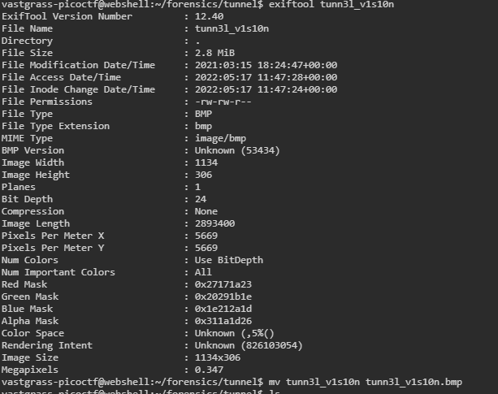

<!--
 * @Date: 2022-05-17 19:36:51
 * @LastEditors: asderfree
 * @LastEditTime: 2022-05-24 09:53:35
 * @FilePath: \test_env\picoCtf\notes.md
 * @Description:
-->
## some useful linux command:
1. binwalk: a tool for searching binary images for embedded files and executable code;
            一个检索二进制图像中嵌入的（隐藏的）文件与可执行代码的工具
    -B --signature scan 目标文件获取常见文件签名
    -R --raw=<str> Scan target files for the specified sequence of bytes. 扫描指定字节序列的目标文件
    -A --opcodes Scan target file for common executeable opcode signature
    -e automatically extract known file types
2. exiftool: read and write meta information in file:
            一个读取和写入图片元数据的工具
    

3. upx: a tool to compress or expand executable files  

4. tshark: a terminate sharkwine tool, dump and analyze network traffic:
        tshark [ -i <capture interface>|- ] [ -f <capture filter> ] [ -2 ] [ -r <infile> ] [ -w <outfile>|- ] [ options ] [ <filter> ]
        tshark -G [ <report type> ] [ --elastic-mapping-filter <protocols> ]
    options:    
        -2 perform a two-pass analysis, this causes TShark to buffer output until the entire first pass is done
        -Y|--display-filter: cause the specified filter.使用它而不是 -R 来使用单遍分析进行过滤。如果进行两遍分析（参见-2).那么只有匹配读取过滤器（如果有）的数据包将根据该过滤器进行检查。