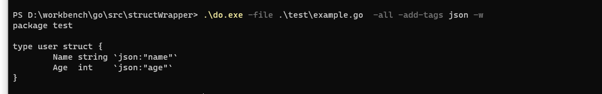

#### 参考自 https://github.com/fatih/gomodifytags/blob/main/main.go
# Struct Wrapper
 ~~~shell
 This is a project that will read the code of a struct and generate the wrapper of the struct.
eg:
~~~
example.go
~~~go
package test

type user struct {
    Name string
    Age int
}
~~~
Then, use the tool to generate the json wrapper is:
~~~shell
.\do.exe -file .\test\example.go  -all -add-tags json -w
~~~
you can see the output is:

and the file example.go will change to :
~~~go
package test

type user struct {
	Name string `json:"name"`
	Age  int    `json:"age"`
}
~~~
### options table:
|     option      |                        usage                        |                   eg                   |
|:---------------:|:---------------------------------------------------:|:--------------------------------------:|
|      file       |           the file that contains a struct           |               -file a.go               |
|        w        |         whether to write the original file          |                   -w                   |
|      quiet      | This option will not print the result in the stdout |                 -quiet                 |
|     format      |            output format, json or source            |              -format json              |
|    modified     |||
|     offset      |               the offset in a struct                |               -offset 1                |
|      line       |   the line that we want to process, can be range    |           -line 1 -line 1,3            |
|     struct      |             struct name to be processed             |              -struct test              |
|      field      |      field name in the struct to be processed       |              -field name               |
|       all       |    all process all struct and field in the file     |                  -all                  |
|   remove-tags   |           remove-tags will remove the tag           |           -remove-tags json            |
|   clear-tags    |                   clear all tags                    |              -clear-tags               |
|    add-tags     |      add-tags will add the given tag you give       |             -add-tags json             |
|    override     |       override the current tags use given tag       |               -override                |
| skip-unexported |               skip unexported fields                |            -skip-unexported            |
|    transform    |     transform adds a transform rule adding tags     ||
|      sort       |                    sort the tags                    |                 -sort                  |
|    template     |            format the given tag's value             |   column:{field}, field_name:{field}   |
| remove-options  |     remove the comma separated  list of options     ||
|  clear-options  |                  clear all options                  ||
|   add-options   |                  add the options                    | -add-options json=omitempty,hcl=squash |

